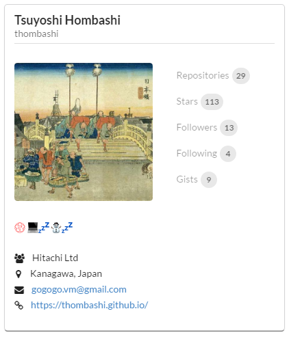

Quick Start
================

CLI Tool Installation
----------------------------------

.. code:: pycon

    pip install ghscard

Generate Card Data Files
----------------------------------

``ghscard gen`` command will create card data file of GitHub user/organization/repository.

.. code:: pycon

    ghscard gen thombashi/thombashi -o data
    [INFO] ghscard gen: written repository data to 'data/thombashi.json'

Add Widget to a HTML
----------------------------------

.. code:: html

    <!doctype html>
    <html>
    <body>
        

        
    </body>
    </html>

This will displayed as follows:

